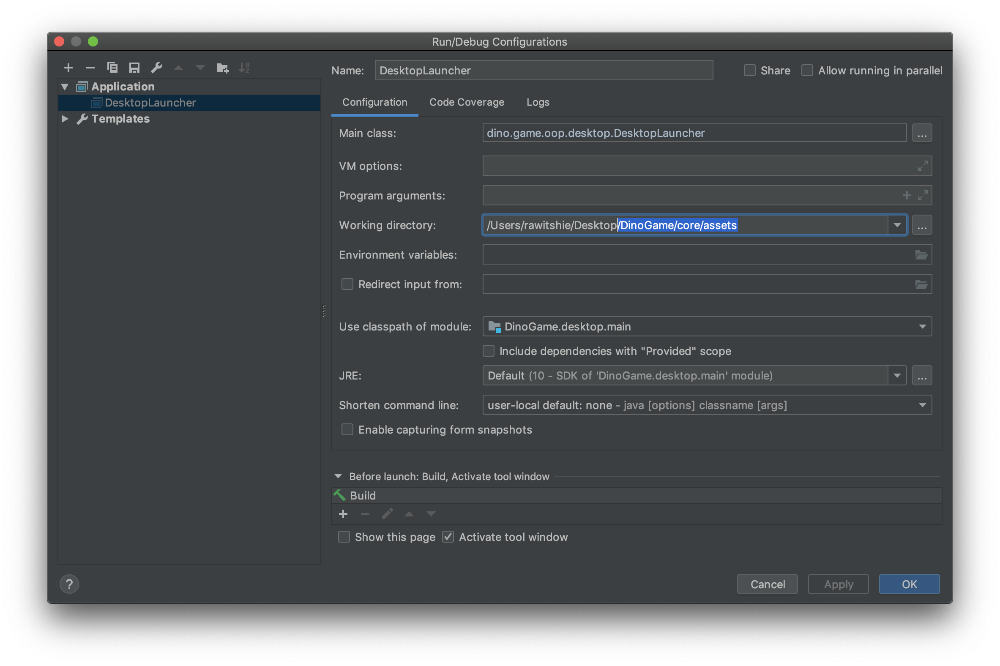

#   Endless-Running Game : Cave Wings
Cave Wings เป็นเกมแบบไม่มีที่สิ้นสุด (Endless-Running Game) โดยมีตัวละครหลักคือ นกสีฟ้า และมีการบังคับโดยการใช้เม้าส์(Mouse) บังคับนกสีฟ้าเพื่อหลบสิ่งกีดขวาง และ เก็บไอเท็ม(เหรียญ และ หัวใจ)

### แนะนำ เป็น Java version 8 - 10


#  Our Tools

* IntelliJ IDEA
* Visual Studio Code
* Adobe Photoshop
* Adobe Illustrator
* JAVA
* libGDX


#  How to Plays

1. เมื่อเข้าเกมมาผู้เล่นจะเห็นหน้าต่างที่มีปุ่ม 3 ปุ่ม คือ ปุ่ม Play(กลาง), ปุ่ม Scoreboard(ซ้าย), ปุ่ม Exit(ขวา)

 

---

2. เมื่อกดปุ่ม Scoreboard เกมจะแสดงคะแนนสูงสุด 3 อันดับแรกของผู้เล่น และมีปุ่มให้กดเพื่อ Reset คะแนน

 

---

3. เมื่อกดปุ่ม Play จะเป็นการเริ่มเล่นเกม และมี Tutorial สอนก่อนเล่นเกม โดยจะมีหลอดพลังชีวิต(ซ้าย) และ คะแนน(ขวาบน)

 

---

4. ไอเท็มในเกมมี 2 ประเภทคือ เหรียญ(คะแนน) และ หัวใจ(พลังชีวิต)

 

---

5. หากชนสิ่งกีดขวางหรือหลอดพลังชีวิตหมด เกมจะจบทันที แล้วแสดงคะแนนล่าสุด และ คะแนน 3 อันดับแรก และมีปุ่มPlay(ซ้าย) ให้กดเล่นอีกครั้ง และปุ่มHome(ขวา) เพื่อกลับไปหน้าแรก

 

---

# Game Rules

- ควบคุมโดยการ คลิกซ้าย แล้วเลื่อน cursor เพื่อควบคุมตัวละคร เพื่อหลีกเลี่ยงสิ่งกีดขวางและเก็บ ITEM
- จุดประสงค์ของการเล่นคือ เก็บเหรียญให้เยอะที่สุด โดยไม่โดนสิ่งกีดขวาง และหลอดเลือดไม่หมด
- หลอดเลือดจะลดลงอย่างต่อเนื่อง
- เมื่อตัวละครโดนสิ่งกีดขวาง หรือ เลือดหมด ถือว่าจบเกม
- การเก็บหัวใจจะทำให้ปริมาณเลือดเพิ่มขึ้น

# Manual Compile
- เราสามารถ เปิด Game ที่เป็น File `.jar` ได้ 
- เราสามารถ run ผ่าน command line ได้โดยไปที่ `path` ของ `.jar` ได้โดยพิมพ์คำสั่ง

```
java -jar CaveWings.jar
```

- ถ้าต้องการที่ จะ Complie จาก IDE ต้องมีการ set `path` ของ Working directory เป็น `../DinoGame/core/assets`


<p align = "center"> รูปตัวอย่างของ Configuration ในการ set path ใน IntelliJ</p>

___

#  Team Members
|  |ชื่อ|นามสกุล|GitHub Username|รหัสนักศึกษา|
|:-:|--|------|---------------|---------|
||กวิสรา|บัณเย็น|[@zelotype](https://github.com/zelotype)|60070002|
||รวิชญ์|โลหะขจรพันธ์|[@RawitSHIE](https://github.com/RawitSHIEK)|60070081|
||ศุภกิตติ์|เธียรธัญญกิจ|[@POKINBKK](https://github.com/POKINBKK)|60070098|

#### [ส่วนรายงาน และ JAR file](https://github.com/oop-it-kmitl-61/DinoGame/tree/master/Report%20and%20JAR)


---

#  Assistant Teacher
|ผศ.ดร. ธนิศา นุ่มนนท์|
|:-:|
||

รายงานนี้เป็นส่วนหนึ่งของวิชา Object-Oriented Programming (รหัส 06016317)

คณะเทคโนโลยีสารสนเทศ สถาบันเทคโนโลยีพระจอมเกล้าเจ้าคุณทหารลาดกระบัง


# 🔗Reference

[Libgdx](https://libgdx.badlogicgames.com/)


<p align="center">

</p>
<p align="center">Faculty of Information Technology</p>
<p align="center">King Mongkut's Institute of Technology Ladkrabang</p>

---